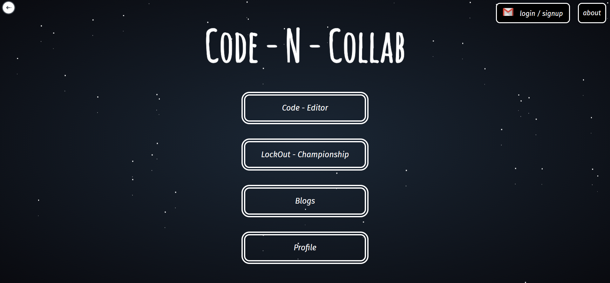
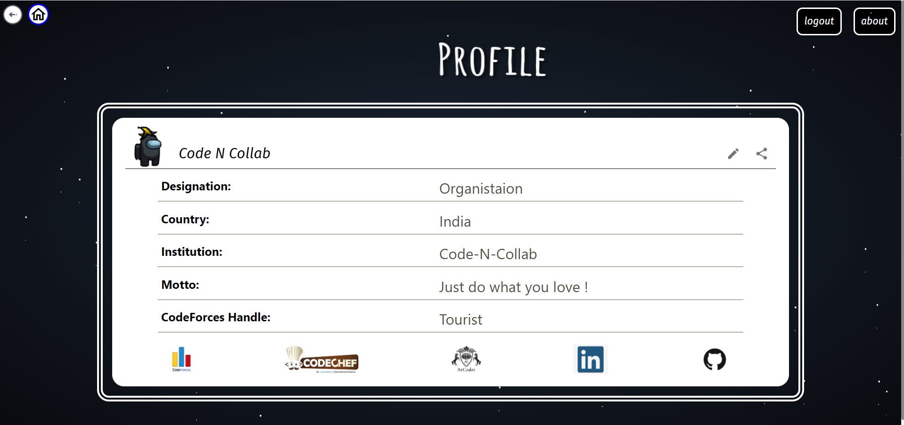
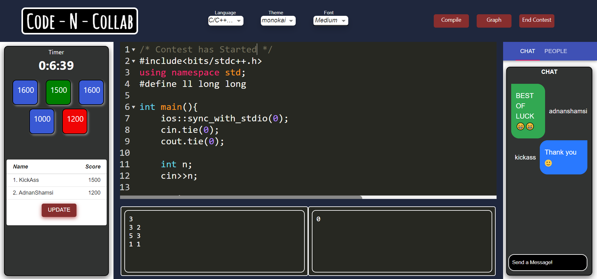

<details open="open">
  <summary>Table of Contents</summary>
  <ol>
    <li>
      <a href="#-about">About</a>
      <ul>
        <li><a href="#-features">Features</a></li>
      </ul>
    </li>
    <li>
      <a href="#-getting-started">Getting Started</a>
      <ul>
        <li><a href="#prerequisites">Prerequisites</a></li>
      </ul>
         <ul>
        <li><a href="#installation">Installation</a></li>
      </ul>
    </li>
    <li><a href="#-contribution-guidelines">Contributing</a></li>
    <li><a href="#-contact">Contact</a></li>
    <li><a href="#-resources">Resources</a></li>
    <li><a href="#license">License</a></li>
  </ol>
</details>
<table >
   <tr>
     <td>
        
     </td>
     <td >
       
     </td>
   </tr>
   <tr>
     <td>
       
     </td>
     
   </tr>
</table>
 </a>

# 🔖 About

Real-Time Collaborative Coding Platform is a Collaboration website for Software developers , Competitive coders , and every one who loves to code and collaborate with others to learn and grow. It provides users to collaborate with their team , friends and also find people with similar their interests.

### Website

[Real-Time Collaborative Coding Platform]

## 🚀 Features

It provides users with :-

- Real-time code editor : Users can collaborate with their team on issues and solve CP problems using a real-time code-editor(like Google Docs)

- Lockout Championship : For Cp lovers, they can compete in a lockout championships with their friends to and challenge your friends for championship,filter problems with preferred difficulty and improve you CP skills

- Blogs : To find new people and share your knowledge , platform provides users blogs to write learn and share

## 🔥 Getting Started

### Prerequisites

- <a href="https://reactjs.org/">Reactjs</a>
- <a href="https://nodejs.org/en/">Nodejs</a>

#### Setup Environment variables

```
     REACT_APP_SIGNALLING_URL1 = wss://y-webrtc-signaling-eu.herokuapp.com
     REACT_APP_SIGNALLING_URL2 = wss://y-webrtc-signaling-us.herokuapp.com
     REACT_APP_BASE_URL = 'http://localhost:8080/'
```

#### Setup backend for Real-Time Collaborative Coding Platform

### Installation

- Fork the Repository

```
   $ git clone https://github.com/<your-username>/Real-Time Collaborative Coding Platform.git
   $ cd Real-Time Collaborative Coding Platform
   $ git remote add upstream https://github.com/sachin8935/Real-Time-Collaborative-Coding-Platform.git
   $ npm install
   $ npm start
```

## 📲 Contact

<a href="https://www.linkedin.com/in/startwithsachin/">Sachin Kumar</a> - sachin89359@gmail.com
<br>

## 📚 Resources

- <a href="https://socket.io/docs/v4" >Socket.Io Documentation </a>
- <a href="https://github.com/yjs/yjs/blob/master/README.md" > Yjs Docs </a>
- <a href="https://github.com/scniro/react-codemirror2">React-Codemirror Editor Docs</a>
